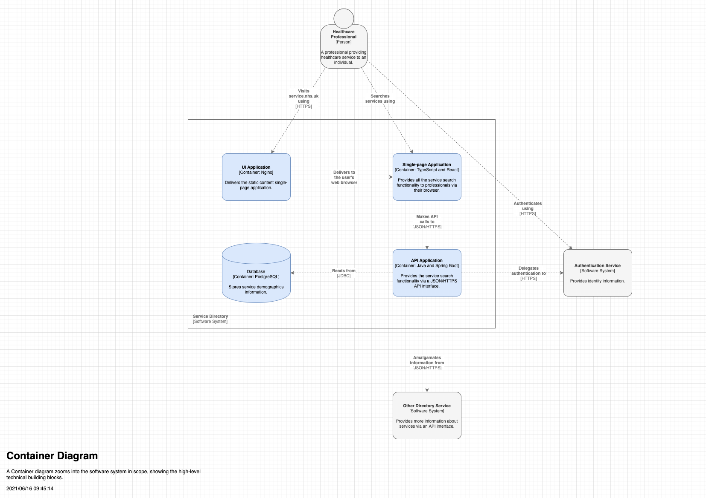
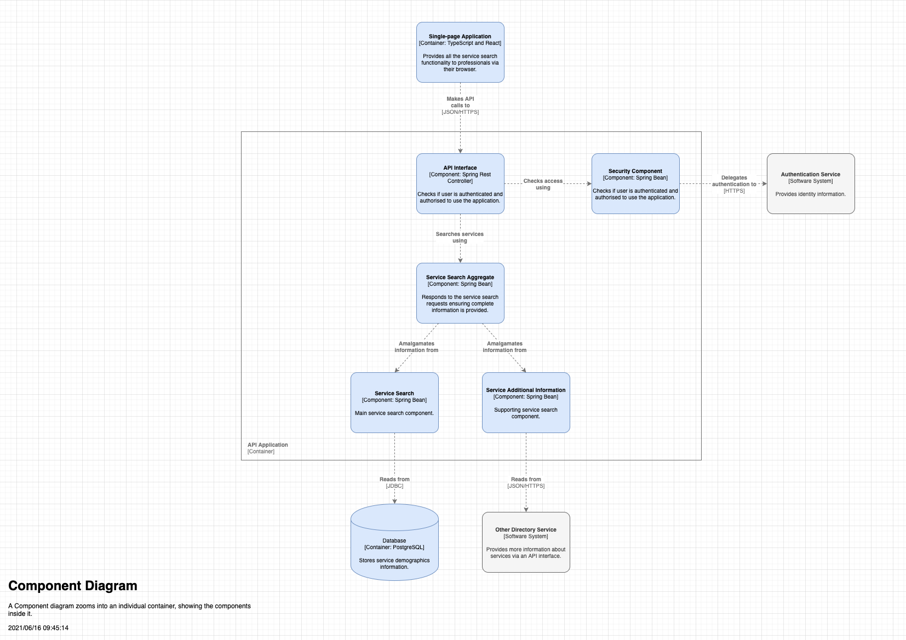

# DoS Service Fuzzy Search API

## Table of Contents

- [DoS Service Fuzzy Search API](#dos-service-fuzzy-search-api)
  - [Table of Contents](#table-of-contents)
  - [Overview](#overview)
    - [Search Terms](#search-terms)
    - [Search Prioritisation](#search-prioritisation)
    - [Fuzz Level](#fuzz-level)
    - [Number of matches returned](#number-of-matches-returned)
  - [Local Project Setup](#local-project-setup)
    - [Development Requirements](#development-requirements)
    - [Local Environment Configuration](#local-environment-configuration)
    - [Start application](#start-application)
    - [Running the API unit tests](#running-the-api-unit-tests)
    - [Stopping the API](#stopping-the-api)
  - [Loading test data](#loading-test-data)
    - [Loading test data into Elasticsearch](#loading-test-data-into-elasticsearch)
    - [Loading the full service data into Elasticsearch](#loading-the-full-service-data-into-elasticsearch)
    - [Clearing out data from the service index](#clearing-out-data-from-the-service-index)
  - [Testing](#testing)
  - [Documentation](#documentation)
  - [Contributing](#contributing)
  - [Artefact Versioning](#artefact-versioning)
  - [Deployment](#deployment)
    - [Deployment From the Command-line](#deployment-from-the-command-line)
    - [CI/CD Pipelines](#cicd-pipelines)
    - [Release Tag Pipeline](#release-tag-pipeline)
  - [Secrets](#secrets)
  - [AWS Access](#aws-access)
  - [Architecture](#architecture)
    - [Diagrams](#diagrams)
      - [System Context Diagram](#system-context-diagram)
      - [Container Diagram](#container-diagram)
      - [Component Diagram](#component-diagram)
      - [Infrastructure / Networking](#infrastructure--networking)
    - [Integration](#integration)
      - [Interfaces](#interfaces)
    - [Authentication and authorisation](#authentication-and-authorisation)
    - [Technology Stack](#technology-stack)
    - [Key Architectural Decisions](#key-architectural-decisions)
    - [System Quality Attributes](#system-quality-attributes)
    - [Guiding Principles](#guiding-principles)
  - [Operation](#operation)
    - [Error Handling](#error-handling)
    - [Observability](#observability)
    - [Auditing](#auditing)
    - [Backups](#backups)
    - [Cloud Environments](#cloud-environments)
    - [Runbooks](#runbooks)
  - [Product](#product)
    - [Communications](#communications)
## Overview

This is the DoS Service Fuzzy Search API. This is a RESTFUL API which will return a list of services that match the search criteria passed to the API. The API will perform fuzzy matching on the search criteria specified, and will fuzzy match against the following service attributes:

- service name
- service public name
- service address
- service postcode

### Search Terms

The service search endpoint requires at least one search term to be passed through as a query parameter. The query parameter is as follows:

    search_term

The minimum number of characters allowed in a the search term is set by the `CONFIGURATION.VALIDATION.MIN_SEARCH_STRING_LENGTH` environment variable. The maximum number of search terms allowed is set by the `CONFIGURATION.VALIDATION.MAX_SEARCH_CRITERIA` environment variable.

### Search Prioritisation

The service search endpoint also allows for a number of search prioritisation parameters to be passed through so as to tailor the search to prioritise the matching of certain fields above others. For example, it may be the case that the matching of the service public name is more important than the matching of the service address. These variants can be catered for using the following search prioritisation query parameters:

    name_priority
    public_name_priority
    address_priority
    postcode_priority

The search prioritisation parameters are all optional, and default values will be applied if they are not passed through. The default values are set via correspondingly named environment variables. If values are provided they should be in the range of between 0 and 100.

### Fuzz Level

The service search endpoint will apply a zero level of fuzzy logic to the search terms by default. But this too can be configured by passing a value of between 0 and 2 into the following query parameter:

    fuzz_level

The value 0 means that the API will apply no fuzzy logic to the search terms, while a value of 2 will apply a maximum level of fuzziness.

### Number of matches returned

Also configurable is the number of matched services returned. This can be configured by supplying a value for the following query parameter:

    max_num_services_to_return

If set, this value should range from between 1 and 100.

## Local Project Setup

### Development Requirements

- macOS operating system provisioned with the `curl -L bit.ly/make-devops-macos-setup | bash` command
- `iTerm2` command-line terminal and `Visual Studio Code` source code editor, which will be installed automatically for you in the next steps

### Local Environment Configuration

Clone the repository

    git clone https://github.com/nhsd-exeter/dos-service-fuzzy-search-api
    cd ./dos-service-fuzzy-search-api

The following is equivalent to the `curl -L bit.ly/make-devops-macos-setup | bash` command

    make macos-setup

Please, ask one of your colleagues for the AWS account numbers used by the project. The next command will prompt you to provide them. This information can be sourced from a properly set up project by running `make show-configuration | grep ^AWS_ACCOUNT_ID_`

    make devops-setup-aws-accounts

Generate and trust a self-signed certificate that will be used locally to enable encryption in transit

    make trust-certificate

### Start application

  To build the API, run the following make target:

    make build

  To start the API locally, run the following make target:

    make start log

  In the local environment, a mock authentication token is required to be provided in all requests to the API endpoints. Please provide the token of 'MOCK_FUZZY_API_ACCESS_TOKEN' in the request in order to pass authentication in the local environment.

  Once started, full Swagger API documentation can be found at this endpoint: https://localhost/swagger-ui.html

  When the API is running the URL (home page) to the API is: http://127.0.0.1:8443/dosapi/dosservices/v0.0.1

The API has a single GET Rest endpoint:

- /byfuzzysearch

The API will return a list of matching services in JSON format. This is defined on Confluence: [Known Service Search](https://nhsd-confluence.digital.nhs.uk/display/SFDEV/Known+Service+Search)

The supporting components are:

- Elasticsearch
- Kibana
- DoS Test Database
- Alerting Lambda functions

### Running the API unit tests

The unit tests for the API can be run by executing the following command:

    make test

Note that the unit tests rely on the project having being started. (make start)

### Stopping the API

The API can be stopped by running the following command:

    make stop

## Loading test data
### Loading test data into Elasticsearch

Test data is loaded in to the application during the `make start` command. If during development you wish to run the application without loading the test data for speed of development you can run `make quick-restart`.

To load the test data into the locally running containerized version of elasticsearch, run the following command:

    make load-test-data

Note that test data can only be loaded into elasticsearch if the elasticsearch component is running.
The test data is stored here:

    build/data/services/service_data.sh

### Loading the full service data into Elasticsearch

The full service data set contains over 65,000 services. These services have been extracted from the test DoS database. To load or refresh these services into an Elasticsearch domain, invoke the following make target:

    make load-all-services PROFILE=local

Note that `PROFILE` is a mandatory and the setting of this parameter determines where to load the data. A setting of local will load the full service data set into a locally running containerised instance of Elasticsearch, while a setting of dev will load the data set into an AWS instance of Elasticsearch running within the Texas non-prod environment.

The service data files themselves are created by running the SQL code in the service_sql.txt file against a DoS database.

### Clearing out data from the service index

To clear out data from elasticsearch (service index), use the following command:

    curl -XDELETE http://localhost:9200/service

## Testing

The following test types are present in this project:

- Unit - to run unit tests run the following make target: make unit-test
- Contract - to run contract tests run the following make target: make run-contract-test
- Performance - these tests are run in the performance pipeline
- Load - these tests are run in the load pipeline
- Stress - these tests are run in the stress pipeline
- Smoke - to run smoke tests run the following make target: make run-smoke-test

For more information please see [README.md](test/contract/README.md)

## Documentation

Please see the /documentation section for supplementary information, diagrams, and flows for this API.

## Contributing

Here is the list of the development practices that have to be followed by the team and the individual members:

- Only use single canonical branch **master**. Any intermediate branch significantly increases the maintenance overhead of the repository.
- Apply the git rebase workflow and never merge from master to a task branch. Follow the **squash-rebase-merge** pattern to keep the history linear and clean.
- Cryptographically sign your commits using **gpg** to ensure its content have not been tampered with.
- Format the summary message of your pull request (merge request) using the following pattern **"JIRA-XXX Summary of the change being made"** for complines and clarity as well as to enable tooling to produce release notes automatically.
- Announce your PR/MR on the development Slack channel to allow any team member to review it and to share the knowledge. A change can be merged only if all comments have been addressed and it has been **approved by at least one peer**. Make good use of paring/mobbing/swarming practices for collaborative coding.

Before starting any work, please read [CONTRIBUTING.md](documentation/CONTRIBUTING.md) for more detailed instructions.

## Artefact Versioning

This project uses semantic versioning. i.e. 0.0.1 (major, minor, patch)

## Deployment

The following section describes the pipelines that are available in this project. All pipelines reside under the 'Fuzzy Search API' tab in Jenkins

### Deployment From the Command-line

  To deploy the API into the dev environment directly from the command line, run the following make target:

    make deploy PROFILE=dev IMAGE_TAG=<The image that you want to deploy>

  To deploy (create or update) the infrastructure into the dev environment directly from the command line, run the following make target:

    make terraform-apply PROFILE=dev STACKS=<a list of stacks that you want to apply>

### CI/CD Pipelines

List all the pipelines and their purpose

- Development - this pipeline is used to plan infrastructure, build and test the API, push the built image to the ECR. The pipeline will be triggered with each code check in.
- Development Deployment - this pipeline is used to create and update infrastructure, deploy a pre-built image, run smoke tests against the deployed image. This pipeline is configured to deploy into the dev environment in the texas nonprod account, and is manually triggered.
- Demo (deployment) - this pipeline is similar to the Development Deployment pipeline, but is deploys to the demo environment in the texas prod account.
- Production (deployment) - this pipeline is similar to the Development Deployment pipeline, but is deploys to the production environment in the texas prod account.

For more information on the following pipeline please see [README.md](test/jmeter/README.md)
- Performance Test - this pipeline is used to run a performance test suite against the API.
- Load Test - this pipeline is used to run a load test suite against the API.
- Stress Test - this pipeline is used to run a stress test suite against the API.
### Release Tag Pipeline

The release tag pipeline will promote a 'development' image into the 'production' ECR and will tag it with a release tag. The pipeline is configured to run against the master branch only. The pipeline has to be manually run, and the development image tag and release image tag will need to be specified. The pipeline will:

- Promote the specified development image into the production ECR and tag it with the specified release tag

## Secrets

There are no secrets stored in this project.

## AWS Access

To be able to interact with a remote environment, please make sure you have set up your AWS CLI credentials and
MFA to the right AWS account using the following command

    tx-mfa

## Architecture

### Diagrams

#### System Context Diagram

  

#### Container Diagram

  

#### Component Diagram

  

#### Infrastructure / Networking

  

### Integration

#### Interfaces

The extraction ETL process interface with the Core DoS SF Read Replica RDS.

In addition, the endpoints of the API are protected by a token based authentication mechanism. A token can be retrieved from the Authentication API given user name and password credentials. The token must be present in all requests to the API endpoints, except for the api home pages and swagger documentation.

### Authentication and authorisation

The endpoints of the API are protected by a token based authentication mechanism. The token itself is generated by a user pool configured in AWS Cognito. The token will contain a set of authorisation groups in which the group 'FUZZY_API_ACCESS' must be present for the token to be authorised access to the API endpoints.

In the local and dev environments, a mock authentication token of 'MOCK_FUZZY_API_ACCESS_TOKEN' can be used in the requests to access the API endpoints.

### Technology Stack

The following technology is used in this project:

- Java (Springboot)
- Python
- Terraform
- K8s
- Docker
- JMeter
- Postman

Key AWS Components:

- S3
- Lambda
- Dynamo

### Key Architectural Decisions

Decision records are [README.md](documentation/adr/README.md)

- [ADR-001_api_authentication](documentation/adr/001_api_authentication.md)

### System Quality Attributes

- Resilience - service operates in multi-AZ and has 3 replicas.
- Performance - high performing elasticsearch for fast retrieval of data.
- Security - all data encrypted at rest and in transit, api endpoints are protected by a token based authentication mechanism
- Supportability - swagger API documentation

### Guiding Principles

The high level principles that the product /development team must adhere to are:

- The solution has to be coded in the open - e.g. NHSD GitHub org
- Be based on the open standards, frameworks and libraries
- API-first design
- Test-first approach
- Apply the automate everything pattern
- AWS-based cloud solution deployable to the NHSD CPaaS Texas platform
- Use of the Make DevOps automation scripts (macOS and Linux)

## Operation

### Error Handling

- Refer to the Swagger API documentation.

### Observability

- Logging

  All API logging is written to Splunk under the following two indexes:

  eks_logs_service_finder_nonprod
  eks_logs_service_finder_prod

  In the event of ETL failure, an error log will be written to the fuzzy-etl-alerts slack channels. There will be a slack channel per environment.

  Cloudwatch logs for the ETLs are also available under the log group of: /aws/lambda/uec-dos-api-sfsa-dev...

- Monitoring

  Instana will be used for monitoring of the service.

- Alerting
  TODO

- Fitness functions

  Standard out of the box Instana monitoring is used to measure the fitness of the service.

### Auditing

No auditing is required in this project

### Backups

No backups are required for this project since we do not change the underlying data and the data itself is sourced from Core DoS.

### Cloud Environments

- Development
  - Profile: `dev`
  - URL address: [ https://uec-dos-api-sfsa-dev-uec-dos-api-sfs-service.k8s-nonprod.texasplatform.uk/]( https://uec-dos-api-sfsa-dev-uec-dos-api-sfs-service.k8s-nonprod.texasplatform.uk/)
- Demo
  - Profile `demo`
  - URL address: [ https://uec-dos-api-sfsa-demo-uec-dos-api-sfs-service.k8s-prod.texasplatform.uk]( https://uec-dos-api-sfsa-demo-uec-dos-api-sfs-service.k8s-prod.texasplatform.uk/)
- Live
  - Profile `live`
  - URL address: [ https://uec-dos-api-sfsa-prod-uec-dos-api-sfs-service.k8s-prod.texasplatform.uk/]( https://uec-dos-api-sfsa-prod-uec-dos-api-sfs-service.k8s-prod.texasplatform.uk/)

### Runbooks

No runbooks present at this point in time.

## Product

### Communications

- Slack channels
  - ETL alerts: postcode-etl-alerts
